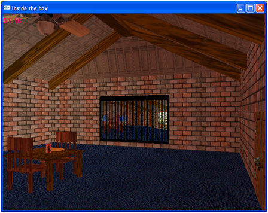

**Program Due:**

**Milestone 1: Thursday, Oct 18th by 12:30/2:00 PM**  10% - This milestone should demonstrate the basic geometry of the scene (placeholder objects can be used where more complex objects will eventually be located). An orthographic "birds-eye" view is acceptable at this point to see the entire room.

**Milestone 2: Tuesday, Nov 20st by 12:30/2:00 PM**  10% - This milestone should contain most of the geometry that will appear in the final scene. First person camera controls should allow movement throughout the room (but not necessarily with collision detection). Lighting effects should be present.

**Final Presentation: ** 80% - Please bring your project on a flash drive (as it may be rather large depending on the number of textures used) and turn it in during class. [HERE ARE INSTRUCTIONS FOR COPYING YOUR PROJECT TO A USB DRIVE.](ProjectSubmit.html) Late assignments will **NOT** be accepted.

**Evaluation Form** Word document for the project can be found [here](CS370_Final_Project_eval.docx).

Getting Started
===============

Download [CS370\_Project.zip](src/CS370_Project.zip), saving it into the **assignment** directory.

Double-click on **CS370\_Project.zip** and extract the contents of the archive into a subdirectory called **CS370\_Project**

Navigate into the **CS370\_Project** directory and double-click on **CS370\_Project.sln** (the file with the little Visual Studio icon with the 13 on it).

If the source file is not already open in the main window, open the source file by expanding the *Source Files* item in the *Solution Explorer* window and double-clicking **Project.cpp**.

The skeleton project is primarily an empty source. You may add any additional header files and resources (e.g. images) as desired.

Programming assignment
======================

The object of this project is to do a "walk through" of a room. You should create a room with various texture mapped objects and allow the user to "walk through" the room to view it from different locations/orientations (the basis of a fps).

-   The room should have a floor, ceiling, and four walls (but need not be square).

    > -   Put "carpet" on the floor.
    > -   The other walls can simply be "painted" a solid color.

-   One of the walls should have a door made of "wood".

    > -   It can be a slab door.
    > -   Hinges and a door knob are optional.

-   An adjacent wall should have a window with a mini-blind.

    > -   Use 'O' (or 'o') to open and close the blinds revealing an outdoor scene through the window. (Hint: Use a texture mapped rectangle for the window pane.)

-   The opposite wall should have a large mirror that "reflects" the room.
-   The fourth wall should have a work of art hanging on it.
-   Place a "wooden" table and chairs in the center of the room.

    > -   Place a soda can on the table.
    > -   Place a translucent glass partially full of soda on the table.
    > -   Place a bowl of "spherical" fruit on the table.

-   Add a rotating ceiling fan on the ceiling.

    > -   A wall switch should toggle the fan via 'F' (or 'f'). You do not need to worry about proximity to the switch to operate it.

-   Add a light located at the center of the ceiling - roughly where the ceiling fan is.

    > -   A wall switch should toggle the light via 'L' (or 'l'). You do not need to worry about proximity to the switch to operate it.

-   The first person camera view should be able to

    > -   'W' (or 'w') - move forward in the CURRENT direction
    > -   'S' (or 's') - move backward in the CURRENT direction
    > -   'A' (or 'a') - turn left (azimuth)
    > -   'D' (or 'd') - turn right (azimuth)
    > -   'Z' (or 'z') - look up (elevation)
    > -   'X' (or 'x') - look down (elevation)

-   The camera should remain at a *fixed height* (i.e. "eye level").
-   The camera should *not* leave the room (although you do not need to worry about object avoidance within the room).
-   The field of view and frustum distance should be fixed *relative to the camera*.
-   All animations should be system *independent*, i.e. should be time-based, including fan rotation, blinds opening, etc.
-   All effects should be done in programmable shaders.

Hints
=====

**START EARLY!** You should be developing the scene incrementally such that you always have a working program prior to adding an additional feature.

You may wish to use default pipeline behavior for testing purposes.

Some embellishment suggestions:

-   Implement "mouselook" typical of standard fps (along with 'a' and 'd' strafing)
-   Use a 3D modelling program such as Blender to create more sophisticated geometry and figure out how to load the models for use in OpenGL
-   Use enhanced programmable shader effects to add effects beyond default pipeline behavior.

Most of all - **HAVE FUN!** and be creative with this project.

Grading Criteria
================

**The program MUST compile to receive any credit** (so develop incrementally).

The program will be graded based on the number of features implemented along with the creativity used to implement each one.

Compiling and running the program
=================================

Once you have completed typing in the code, you can build and run the program in one of two ways:

> -   Click the small green arrow in the middle of the top toolbar
> -   Hit **F5** (or **Ctrl-F5**)

(On Linux/OSX: In a terminal window, navigate to the directory containing the source file and simply type **make**. To run the program type **./Project.exe**)

> 

To quit the program simply close the window.

Submitting
==========

**DO NOT** submit the project through Marmoset. Instead be sure to bring a USB drive with the project to class during the final exam period.

**You are responsible for making sure that your submission contains the correct file(s).**

